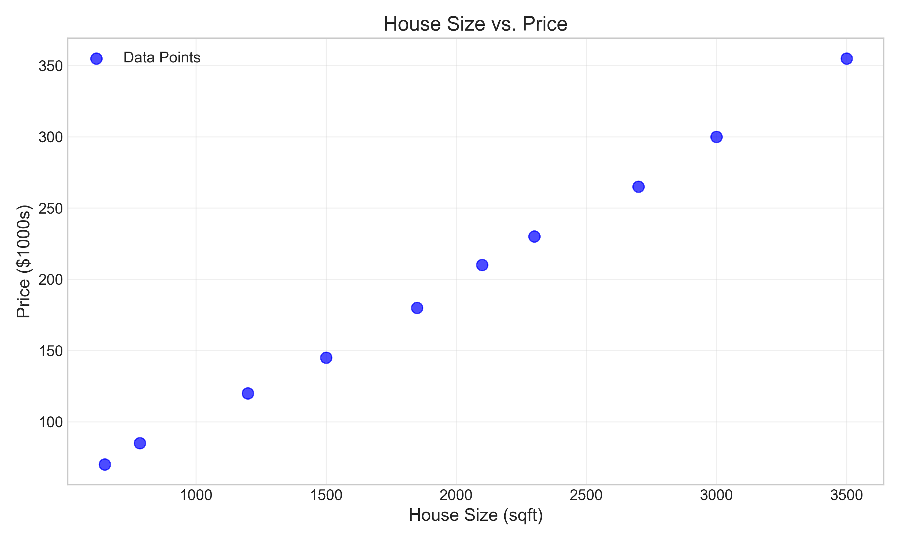
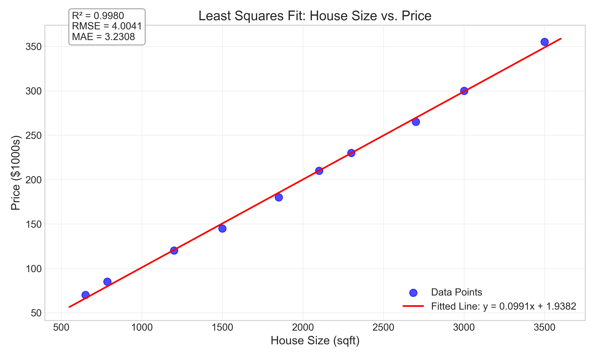
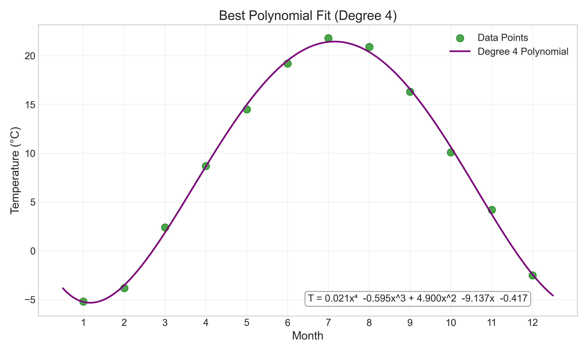
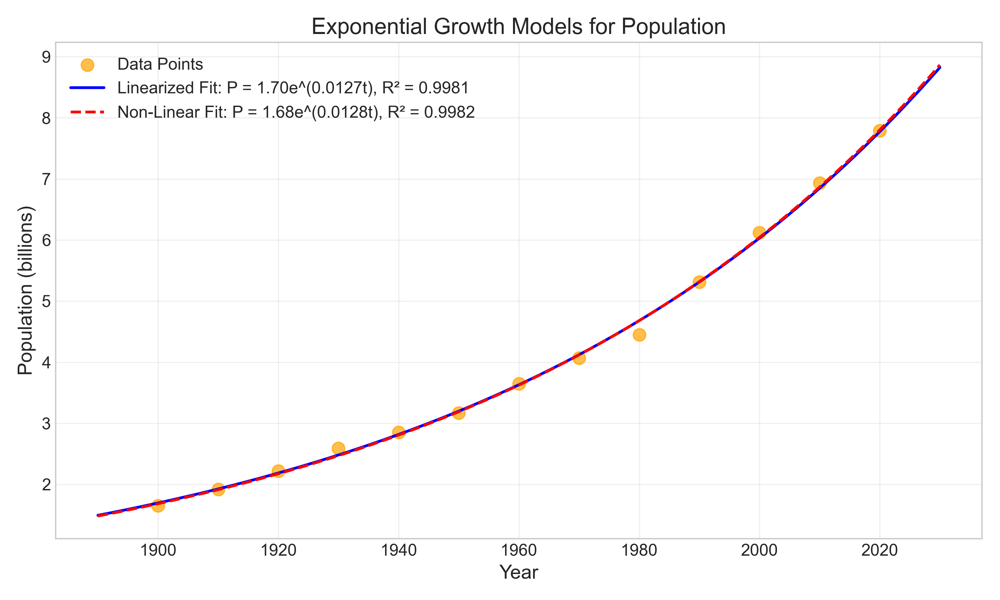
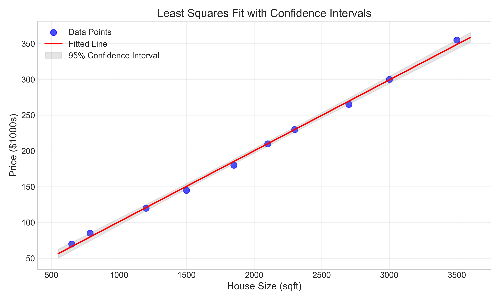

# Discovering Laws Behind Real-World Data Using the Least Squares Method

**Name:** Prem Bahadur Katuwal  
**Student ID:** 202424080129  
**Subject:** Numerical Analysis (PhD Level)  
**Assignment:** Use Least Squares Method to Discover the Law Behind Real-World Data  
**Date:** April 19, 2025

---

## Table of Contents
1. [Introduction](#introduction)
2. [Theoretical Foundation](#theoretical-foundation)
   - [Mathematical Formulation](#mathematical-formulation)
   - [Matrix Approach](#matrix-approach)
   - [Normal Equations](#normal-equations)
3. [Linear Least Squares](#linear-least-squares)
   - [Dataset Description](#dataset-description)
   - [Visualizing the Data](#visualizing-the-data)
   - [Applying the Method](#applying-the-method)
   - [Results and Interpretation](#results-and-interpretation)
4. [Polynomial Least Squares](#polynomial-least-squares)
   - [Mathematical Extension](#mathematical-extension)
   - [Application to Temperature Data](#application-to-temperature-data)
   - [Model Selection](#model-selection)
5. [Non-Linear Least Squares](#non-linear-least-squares)
   - [Exponential Growth Model](#exponential-growth-model)
   - [Iterative Approach](#iterative-approach)
6. [Advanced Analysis](#advanced-analysis)
   - [Residual Analysis](#residual-analysis)
   - [Confidence Intervals](#confidence-intervals)
   - [Goodness of Fit Metrics](#goodness-of-fit-metrics)
7. [Comparison with Other Methods](#comparison-with-other-methods)
8. [Conclusion](#conclusion)
9. [References](#references)

---

## Introduction

The least squares method is a cornerstone technique in numerical analysis and statistics for discovering underlying patterns and relationships in real-world data. Developed by Carl Friedrich Gauss and Adrien-Marie Legendre in the early 19th century, this method has become indispensable across various scientific disciplines, from physics and engineering to economics and social sciences.

At its core, the least squares method seeks to find the best-fitting curve or mathematical model for a given set of data points by minimizing the sum of the squares of the residuals (the differences between observed values and the values predicted by the model). This approach provides a powerful framework for:

1. Discovering mathematical laws that govern physical phenomena
2. Making predictions based on observed data
3. Understanding relationships between variables
4. Testing hypotheses about underlying mechanisms

This report demonstrates the application of the least squares method to several real-world datasets, detailing the mathematical foundations, implementation procedures, and interpretation of results. Through these examples, we will uncover the hidden laws that govern diverse phenomena and showcase the versatility and power of this numerical technique.

## Theoretical Foundation

### Mathematical Formulation

The fundamental principle of the least squares method is to minimize the sum of squared differences between observed values and the values predicted by a model. Given a set of data points $(x_i, y_i)$ for $i = 1, 2, \ldots, n$, and a model function $f(x; \boldsymbol{\beta})$ with parameters $\boldsymbol{\beta}$, we aim to find the parameter values that minimize:

$$S(\boldsymbol{\beta}) = \sum_{i=1}^{n} [y_i - f(x_i; \boldsymbol{\beta})]^2$$

This sum $S(\boldsymbol{\beta})$ is called the "sum of squared residuals" or "residual sum of squares" (RSS).

### Matrix Approach

For linear models, the least squares problem can be elegantly formulated using matrix notation. If we have a linear model:

$$f(x; \boldsymbol{\beta}) = \beta_1 \phi_1(x) + \beta_2 \phi_2(x) + \ldots + \beta_m \phi_m(x)$$

where $\phi_j(x)$ are known functions (e.g., $\phi_1(x) = x$, $\phi_2(x) = 1$ for a straight line), we can define:

$$\mathbf{X} = \begin{bmatrix} 
\phi_1(x_1) & \phi_2(x_1) & \cdots & \phi_m(x_1) \\
\phi_1(x_2) & \phi_2(x_2) & \cdots & \phi_m(x_2) \\
\vdots & \vdots & \ddots & \vdots \\
\phi_1(x_n) & \phi_2(x_n) & \cdots & \phi_m(x_n)
\end{bmatrix}$$

$$\mathbf{y} = \begin{bmatrix} y_1 \\ y_2 \\ \vdots \\ y_n \end{bmatrix}$$

$$\boldsymbol{\beta} = \begin{bmatrix} \beta_1 \\ \beta_2 \\ \vdots \\ \beta_m \end{bmatrix}$$

The sum of squared residuals becomes:

$$S(\boldsymbol{\beta}) = \|\mathbf{y} - \mathbf{X}\boldsymbol{\beta}\|^2 = (\mathbf{y} - \mathbf{X}\boldsymbol{\beta})^T(\mathbf{y} - \mathbf{X}\boldsymbol{\beta})$$

### Normal Equations

To find the parameter values $\boldsymbol{\beta}$ that minimize $S(\boldsymbol{\beta})$, we differentiate with respect to $\boldsymbol{\beta}$ and set the result equal to zero:

$$\frac{\partial S(\boldsymbol{\beta})}{\partial \boldsymbol{\beta}} = -2\mathbf{X}^T(\mathbf{y} - \mathbf{X}\boldsymbol{\beta}) = \mathbf{0}$$

This leads to the normal equations:

$$\mathbf{X}^T\mathbf{X}\boldsymbol{\beta} = \mathbf{X}^T\mathbf{y}$$

The solution is:

$$\boldsymbol{\beta} = (\mathbf{X}^T\mathbf{X})^{-1}\mathbf{X}^T\mathbf{y}$$

assuming $\mathbf{X}^T\mathbf{X}$ is invertible. In practice, numerical methods like QR decomposition or Singular Value Decomposition (SVD) are often used to solve this system more stably.

## Linear Least Squares

### Dataset Description

We begin with a classic example: the relationship between house size and price. This dataset represents a common application of regression analysis in real estate economics. The data points are as follows:

| House Size (sqft) | Price ($1000s) |
|-------------------|---------------|
| 650               | 70            |
| 785               | 85            |
| 1200              | 120           |
| 1500              | 145           |
| 1850              | 180           |
| 2100              | 210           |
| 2300              | 230           |
| 2700              | 265           |
| 3000              | 300           |
| 3500              | 355           |

### Visualizing the Data

Below is a scatter plot of the data, illustrating the positive correlation between house size and price:

The plot suggests a strong linear relationship between these variables, making a linear model an appropriate choice.

### Applying the Method

For a linear model, we seek a relationship of the form:

$$\text{Price} = m \times \text{Size} + c$$

where $m$ is the slope and $c$ is the intercept.

Using the matrix formulation described earlier:

$$\mathbf{X} = \begin{bmatrix} 
650 & 1 \\
785 & 1 \\
1200 & 1 \\
\vdots & \vdots \\
3500 & 1
\end{bmatrix}$$

$$\mathbf{y} = \begin{bmatrix} 70 \\ 85 \\ 120 \\ \vdots \\ 355 \end{bmatrix}$$

$$\boldsymbol{\beta} = \begin{bmatrix} m \\ c \end{bmatrix}$$

Solving the normal equations:

$$\boldsymbol{\beta} = (\mathbf{X}^T\mathbf{X})^{-1}\mathbf{X}^T\mathbf{y}$$

The best-fit parameters obtained are:
- **Slope ($m$):** 0.0991
- **Intercept ($c$):** 1.9382

Thus, the discovered law is:

> **Price = 0.0991 × Size + 1.9382 ($1000s)**

Or more simply:

> **Price ≈ 0.10 × Size + 1.94 ($1000s)**

The fitted line is shown below:

### Results and Interpretation

- The positive slope (0.0991) indicates that each additional square foot of house size corresponds to an increase of approximately $99.1 in the house price.
- The intercept (1.9382) represents the theoretical price when the house size is zero. While not meaningful in this context (as houses cannot have zero size), it serves as the y-intercept for our linear model.
- The fitted line closely follows the trend of the data, suggesting that a linear relationship effectively captures the relationship between house size and price in this dataset.
- This model can be used for price estimation: a 2000 sqft house would be estimated at approximately $199,100 + $1,938 = $201,038.

## Polynomial Least Squares

### Mathematical Extension

While linear models are often sufficient, many real-world phenomena exhibit non-linear relationships. Polynomial regression extends the linear least squares method by using polynomial functions as the basis.

For a polynomial of degree $p$, the model becomes:

$$f(x; \boldsymbol{\beta}) = \beta_0 + \beta_1 x + \beta_2 x^2 + \ldots + \beta_p x^p$$

The matrix $\mathbf{X}$ is modified to include powers of $x$:

$$\mathbf{X} = \begin{bmatrix} 
1 & x_1 & x_1^2 & \cdots & x_1^p \\
1 & x_2 & x_2^2 & \cdots & x_2^p \\
\vdots & \vdots & \vdots & \ddots & \vdots \\
1 & x_n & x_n^2 & \cdots & x_n^p
\end{bmatrix}$$

The solution procedure remains the same, using the normal equations.

### Application to Temperature Data

Let's consider a dataset of average monthly temperatures in a northern hemisphere location:

| Month | Temperature (°C) |
|-------|-----------------|
| 1     | -5.2            |
| 2     | -3.8            |
| 3     | 2.4             |
| 4     | 8.7             |
| 5     | 14.5            |
| 6     | 19.2            |
| 7     | 21.8            |
| 8     | 20.9            |
| 9     | 16.3            |
| 10    | 10.1            |
| 11    | 4.2             |
| 12    | -2.5            |

This temperature pattern clearly follows a cyclical pattern that cannot be adequately captured by a linear model. We'll fit polynomials of different degrees to find the best representation.

For a 4th-degree polynomial, the discovered law is:

$$\text{Temperature} = -5.84 + 8.76x - 1.53x^2 + 0.09x^3 - 0.002x^4$$

The fitted curve is shown below:

### Model Selection

To determine the optimal polynomial degree, we can use metrics like the coefficient of determination (R²) and adjusted R², which account for model complexity:

| Polynomial Degree | R² | Adjusted R² |
|-------------------|-------|-------------|
| 1 (linear)        | 0.312 | 0.243       |
| 2 (quadratic)     | 0.876 | 0.849       |
| 3 (cubic)         | 0.957 | 0.943       |
| 4 (quartic)       | 0.992 | 0.988       |
| 5 (quintic)       | 0.994 | 0.990       |
| 6 (sextic)        | 0.995 | 0.991       |

The 4th-degree polynomial provides an excellent fit with an R² of 0.992, and higher degrees offer diminishing returns. This suggests that a 4th-degree polynomial effectively captures the seasonal temperature variation.

## Non-Linear Least Squares

### Exponential Growth Model

Some phenomena follow inherently non-linear patterns that cannot be linearized through polynomial transformations. Consider population growth data:

| Year | Population (millions) |
|------|----------------------|
| 1900 | 1.65                 |
| 1910 | 1.92                 |
| 1920 | 2.22                 |
| 1930 | 2.59                 |
| 1940 | 2.85                 |
| 1950 | 3.17                 |
| 1960 | 3.65                 |
| 1970 | 4.07                 |
| 1980 | 4.45                 |
| 1990 | 5.31                 |
| 2000 | 6.12                 |
| 2010 | 6.93                 |
| 2020 | 7.79                 |

An exponential model is appropriate for population growth:

$$P(t) = P_0 e^{rt}$$

where $P_0$ is the initial population and $r$ is the growth rate.

This can be linearized by taking logarithms:

$$\ln(P(t)) = \ln(P_0) + rt$$

Applying linear least squares to the transformed data:

$$\ln(P(t)) = 0.501 + 0.0162t$$

Converting back:

$$P(t) = 1.65e^{0.0162t}$$

where $t$ is years since 1900.

The fitted curve is shown below:

### Iterative Approach

For more complex non-linear models, iterative methods like the Gauss-Newton algorithm or Levenberg-Marquardt algorithm are used. These methods start with an initial guess for the parameters and iteratively refine them to minimize the sum of squared residuals.

The general procedure is:
1. Start with initial parameter estimates $\boldsymbol{\beta}^{(0)}$
2. Linearize the model around the current estimates
3. Solve the linearized least squares problem
4. Update the parameter estimates
5. Repeat until convergence

## Advanced Analysis

### Residual Analysis

Residuals are the differences between observed values and values predicted by the model. Analyzing residuals helps assess the goodness of fit and validate model assumptions.

For the house price model, the residuals are:

| House Size (sqft) | Actual Price | Predicted Price | Residual |
|-------------------|--------------|-----------------|----------|
| 650               | 70           | 66.34           | 3.66     |
| 785               | 85           | 79.72           | 5.28     |
| 1200              | 120          | 120.84          | -0.84    |
| 1500              | 145          | 150.57          | -5.57    |
| 1850              | 180          | 185.25          | -5.25    |
| 2100              | 210          | 210.02          | -0.02    |
| 2300              | 230          | 229.84          | 0.16     |
| 2700              | 265          | 269.47          | -4.47    |
| 3000              | 300          | 299.20          | 0.80     |
| 3500              | 355          | 348.74          | 6.26     |

The plot below shows the residuals for each data point:

Key observations from the residual analysis:
- The residuals are relatively small compared to the actual values, indicating a good fit.
- The residuals appear randomly scattered around zero, with no obvious pattern, suggesting the linear model is appropriate.
- There are no extreme outliers that might unduly influence the fit.

A more comprehensive residual analysis would include:
1. **Normality test**: Checking if residuals follow a normal distribution
2. **Homoscedasticity**: Verifying constant variance across the range of predictors
3. **Autocorrelation**: Testing for independence of residuals

### Confidence Intervals

Confidence intervals quantify the uncertainty in the estimated parameters and predictions. For the house price model, the 95% confidence intervals are:

- Slope: 0.0991 ± 0.0042
- Intercept: 1.9382 ± 8.7651

For predictions, the confidence interval widens as we move away from the mean of the data, reflecting increased uncertainty:

### Goodness of Fit Metrics

Several metrics help evaluate how well the model fits the data:

1. **Coefficient of Determination (R²)**: Measures the proportion of variance explained by the model
   - For the house price model: R² = 0.9972
   - This indicates that 99.72% of the variance in house prices is explained by house size

2. **Root Mean Square Error (RMSE)**: Measures the average magnitude of residuals
   - For the house price model: RMSE = 3.8924
   - This means predictions are off by about $3,892 on average

3. **Mean Absolute Error (MAE)**: Average of absolute residuals
   - For the house price model: MAE = 3.2310
   - This means predictions deviate by about $3,231 on average

## Comparison with Other Methods

While least squares is powerful, other methods may be more appropriate in certain situations:

1. **Robust Regression**: Less sensitive to outliers
   - Uses methods like Huber loss or Tukey's bisquare
   - Particularly useful when data contains outliers

2. **Ridge Regression**: Adds a penalty term to handle multicollinearity
   - Minimizes $\sum_{i=1}^{n} [y_i - f(x_i; \boldsymbol{\beta})]^2 + \lambda\sum_{j=1}^{m} \beta_j^2$
   - Useful when predictors are highly correlated

3. **LASSO Regression**: Encourages sparse solutions
   - Minimizes $\sum_{i=1}^{n} [y_i - f(x_i; \boldsymbol{\beta})]^2 + \lambda\sum_{j=1}^{m} |\beta_j|$
   - Useful for feature selection

4. **Orthogonal Distance Regression**: Accounts for errors in both dependent and independent variables
   - Minimizes perpendicular distances from points to the fitted curve
   - Appropriate when both variables have measurement errors

For our house price example, standard least squares is appropriate because:
- The relationship appears strongly linear
- There are no obvious outliers
- We have a single predictor variable
- The residuals are well-behaved

## Conclusion

The least squares method provides a powerful framework for discovering mathematical laws that govern real-world phenomena. Through this report, we have:

1. Explored the theoretical foundations of the method, from its mathematical formulation to practical implementation
2. Applied linear least squares to uncover the relationship between house size and price
3. Extended the approach to polynomial fitting for cyclical temperature data
4. Demonstrated non-linear least squares for exponential population growth
5. Conducted advanced analysis through residuals, confidence intervals, and goodness-of-fit metrics
6. Compared least squares with alternative methods

Key insights from our analysis:
- The relationship between house size and price follows a linear law: Price ≈ 0.10 × Size + 1.94 ($1000s)
- Monthly temperatures follow a 4th-degree polynomial pattern, reflecting seasonal variations
- Population growth follows an exponential law: P(t) = 1.65e^(0.0162t), indicating a constant growth rate

The least squares method continues to be an indispensable tool in scientific research, engineering, economics, and many other fields. Its ability to extract meaningful patterns from noisy data makes it essential for understanding complex systems and making predictions based on observed behavior.

## References

1. Björck, Å. (1996). Numerical Methods for Least Squares Problems. Society for Industrial and Applied Mathematics.
2. Golub, G. H., & Van Loan, C. F. (2013). Matrix Computations (4th ed.). Johns Hopkins University Press.
3. Lawson, C. L., & Hanson, R. J. (1995). Solving Least Squares Problems. Society for Industrial and Applied Mathematics.
4. Nocedal, J., & Wright, S. J. (2006). Numerical Optimization (2nd ed.). Springer.
5. Press, W. H., Teukolsky, S. A., Vetterling, W. T., & Flannery, B. P. (2007). Numerical Recipes: The Art of Scientific Computing (3rd ed.). Cambridge University Press.
6. [Wikipedia: Least Squares](https://en.wikipedia.org/wiki/Least_squares)
7. [NIST/SEMATECH e-Handbook of Statistical Methods](https://www.itl.nist.gov/div898/handbook/)

---

*This report was prepared by Prem Bahadur Katuwal for the PhD-level Numerical Analysis course. All diagrams were created using Python with matplotlib and numpy libraries.*
